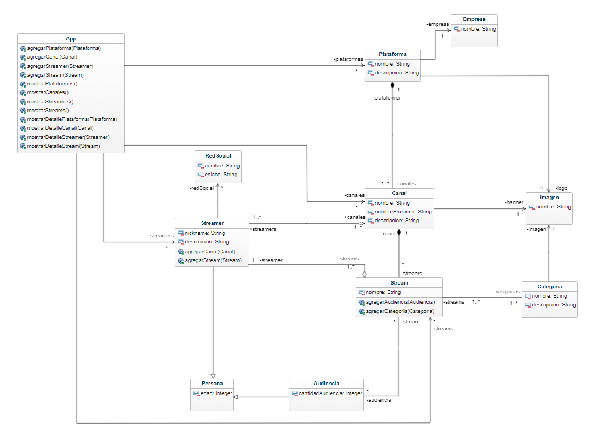

# Streaming Platform

   Aplicación que permite explorar todos los canales de todas las plataformas de streaming en un solo lugar.

   

## Glosario de términos

### Entidades:

1. `Plataforma:` Representa una plataforma de transmisión de streamings. Contiene los siguientes atributos:

   + Nombre: Nombre de la plataforma.
   + Logo: Logo de la plataforma.
   + Descripción: Descripción de la plataforma.
   + Empresa patrocinadora: Empresa que patrocina la plataforma.
   
    
   
2. `Canal:` Representa un canal de transmisión dentro de una plataforma de streaming. Contiene los siguientes atributos:

   + Nombre: Nombre del canal.
   + Banner: Imagen o banner del canal.
   + Nombre del streamer: Nombre del streamer asociado al canal.
   + Descripción detallada: Descripción detallada del canal.

    
   
3. `Streamer:` Representa un streamer, es decir, una persona que realiza transmisiones en los canales de streaming. Contiene los siguientes atributos:

   + Nickname: Apodo o nombre de usuario del streamer.
   + Descripción: Descripción del streamer.

    

4. `Stream:` Representa una transmisión realizada por un streamer en un canal de streaming.

   + Nombre: Nombre del stream.

    

5. `Categoría:` Representa una categoría que describe actividades, espacios y temas abordados durante un stream. Contiene los siguientes atributos:

   + Nombre: Nombre de la categoría.
   + Descripción: Descripción de la categoría.
   + Imagen: Imagen representativa de la categoría.

    

6. `Red Social:` Representa una red social asociada a un streamer. Contiene los siguientes atributos:

   + Nombre: Nombre de la red social.
   + Enlace: Enlace o URL del perfil del streamer en la red social.

    

7. `Empresa:` Representa una empresa que patrocina a una plataforma de streaming. Contiene el siguiente atributo:

   + Nombre: Nombre de la empresa.

    

8. `Audiencia:` Representa la audiencia asociada a un stream. Contiene el siguiente atributo:

   + CantidadAudiencia: Cantidad de audiencia en un stream

    

9. `Imagen:` Representa una imagen, banner o logo. Contiene el siguiente atributo:

   + Nombre: Nombre de la Imagen.

    

10. `Persona:` Representa a una persona. Contiene el siguiente atributo:

   + Edad: Edad de la persona o personas.

    

### Relaciones:

---

+ **`Plataforma - Empresa:`** Una plataforma es patrocinada por una empresa pero no viceversa.. (Relación de "uno") Asociación Unidireccional.

+ `Plataforma - Canal:` Una plataforma puede tener varios canales asociados, pero cada canal pertenece a una única plataforma. (Relación de "uno a muchos") Composición.

+ `Imagen - Plataforma, Canal y Categoría :` Una plataforma, Un canal y Una categoría pueden acceder a una imagen pero no viceversa. (Relación de "uno") Asociación Unidireccional.

+ `Streamer - RedSocial:` Un streamer puede tener 0 o muchas redes sociales asociadas, pero no hay navegabilidad directa desde las redes sociales hacia el streamer. (Relación de "uno") Asociación Unidireccional.

+ `Canal - Streamer:` Cada canal está asociado con uno o muchos streamers o uno o muchos streamers puede tener uno o varios canales.  (Relación de "muchos a muchos") Agregación.

+ `Streamer - Stream:` Un streamer puede realizar varios streams y varios streams estan asociados a un único streamer. (Relación de "uno a muchos") Asociación.

+ `Stream - Categoría:` Un stream puede tener una o muchas categorias y las categorias pueden estar en uno o muchos streams (Relación de "muchos a muchos") Asociación.

+ `Stream - Canal:` Uno o muchos streams estan en un canal y un canal puede tener uno o muchos streams. (Relación de "uno a muchos") Composición.

+ `Stream - Audiencia:` Un stream puede tener 0 a mucha audiencia y esa audiencia puede estar en solo un stream (Relación de "uno a muchos") Asociación.

+ `Persona - Streamer:` Un streamer hereda atributos de persona.

+ `Persona - Audiencia:` La audiencia hereda atributos de persona.
